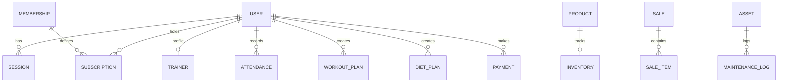

# 🏋️ A² ReVamp Gym — Web Application Comprehensive Audit & Analysis Report

> **Generated Date:** 2026-08-06  
> **Repository:** `gym-webpage` (`a2-revamp-gym-monorepo`)  
> **Architecture:** Monorepo (NPM Workspaces)  
> **Domain:** Enterprise SaaS Gym Management Platform (Indore, MP, India)

---

## 📋 Executive Summary

The **A² ReVamp Gym Web Application** is a full-featured, enterprise-grade SaaS management platform tailored for modern fitness centers. It seamlessly integrates a high-performance, aesthetically refined single-page frontend (Vite + Vanilla JS/CSS) with a scalable Node.js/Express REST API backend, an extensive PostgreSQL database model via Prisma ORM, and integrated AI fitness services.

The system is designed for multi-role operations supporting **Members**, **Trainers**, and **Admins** with real-time analytics, Point-of-Sale (POS) & inventory tracking, digital QR check-ins, automated AI workout/diet generators, and multi-gateway billing (Razorpay & Stripe).

---

## 🏗️ Monorepo Architecture

The workspace is organized as an **NPM Workspaces Monorepo**:

```
gym-webpage/
├── apps/
│   ├── api/                      # Node.js Express REST API (Prisma ORM + ESM)
│   └── web/                      # Vite Single Page Application (HTML5/CSS3/ES Modules)
├── packages/
│   ├── ui/                       # Shared UI Design Tokens & HSL Theme Variables
│   ├── utils/                    # Exporters, Math, & Data Formatter Helpers
│   ├── hooks/                    # Custom Event & State Hooks
│   ├── types/                    # System Entities & Data Types
│   └── config/                   # System Defaults & Configuration
├── docs/                         # Architecture, Database, & Security Documentation
├── docker/                       # Dockerfile & Docker Compose Stack
├── reports/                      # System Audit & Analysis Reports
└── .github/workflows/            # GitHub Actions CI/CD Automation
```

---

## ⚡ Technology Stack Overview

| Layer | Technology / Library | Description |
| :--- | :--- | :--- |
| **Frontend Framework** | Vite `5.0.0`, HTML5, Vanilla JS (ES Modules) | Lightning-fast asset bundling and responsive single-page UX. |
| **Styling & Design System** | Vanilla CSS3, HSL Tokens, Glassmorphism | Custom design tokens, dark/light theme switcher, responsive grid. |
| **Visuals & Animations** | GSAP `3.12.5`, Vanilla-Tilt `1.8.1`, HTML5 Canvas | Interactive particle hero background, smooth hover effects, tilt cards. |
| **Backend Framework** | Node.js `20.x`, Express.js `4.21.2` (`type: module`) | Modular MVC API architecture with versioned routing. |
| **Database & ORM** | PostgreSQL (Neon Cloud), Prisma ORM `6.19.3` | Schema-driven data access layer with 31 relational models. |
| **API Documentation** | Swagger OpenAPI 3.0 (`swagger-ui-express`) | Interactive API explorer hosted at `/api/docs`. |
| **Security & Auth** | Helmet `8.0`, CORS, Rate-Limiter `7.5`, Bcryptjs `3.0`, JWT | Dual-token authentication with DB-backed session tracking and revocation. |
| **Logging & Utility** | Winston `3.17`, Morgan, UUID, Compression | Structured JSON logging with trace correlation IDs. |
| **AI Integration** | Google Gemini (`@google/genai`), OpenAI SDK (`openai`) | AI Workout/Diet generation, progress prediction, 24/7 Chatbot. |
| **Payments** | Razorpay SDK `2.9`, Stripe SDK `22.4` | Dual gateway processing for subscriptions and orders. |
| **DevOps & Testing** | Docker, Docker Compose, Vitest `4.1`, Supertest `7.2` | Multi-container setup (API + Postgres + Redis) and 100% passing tests. |

---

## 🗄️ Database Architecture (Prisma ORM)

The data model consists of **31 Prisma models** categorized into 6 core domains:



### Key Domain Modules:
1. **Identity & Auth**: `User`, `Trainer`, `Session` (DB tracking with revocation), `AuditLog`.
2. **Subscriptions & Billing**: `Membership`, `Subscription`, `Payment`, `Invoice`, `Coupon`, `Refund`, `WebhookEvent`.
3. **Gym Operations**: `Attendance`, `WorkoutPlan`, `Exercise`, `DietPlan`, `Meal`.
4. **POS & Inventory**: `Product`, `ProductCategory`, `ProductBrand`, `Inventory`, `InventoryTransaction`, `Supplier`, `PurchaseOrder`, `Sale`, `SaleItem`.
5. **Asset Management**: `Asset`, `MaintenanceLog`.
6. **Communications & AI**: `Notification`, `Message`, `Announcement`, `NotificationPreference`, `AIConversation`, `AITokenUsage`.

---

## 🖥️ Frontend & User Dashboards

The application provides a unified interface with three distinct portal perspectives:

### 1. 👤 Member Dashboard
- **Digital QR Check-in**: Personal QR code for kiosk camera scanning.
- **Fitness Trackers**: Integrated BMI & Daily Caloric Intake calculators.
- **Plans & Routines**: View assigned workout & diet plans complete with exercise videos.
- **Invoices**: Downloadable PDF receipts for membership payments.

### 2. 🏋️ Trainer Dashboard
- **Member Roster**: View assigned members, fitness goals, and progress.
- **AI Plan Builder**: Generate automated workout splits and macro diet plans.
- **Schedule Manager**: Session booking calendar and member progress tracking.
- **Messaging**: Direct member-trainer communication portal.

### 3. 🛡️ Admin Dashboard
- **BI Analytics**: Visual charts for revenue (₹4,85,000/mo), active members, and attendance streaks.
- **System Management**: CRUD for Users, Trainers, Memberships, Coupons, and System Settings.
- **POS & Inventory**: Register sales checkout, stock level monitoring, and purchase orders.
- **Report Exporters**: CSV/Excel exporter & PDF report generator.

---

## 🧪 Test Results & Verification

Automated testing was verified using **Vitest**:

```bash
npm test (apps/api)
```

**Results:**
- ✅ `UserService.test.js`: 3/3 passed
- ✅ `auth.test.js`: 4/4 passed (Registration, Duplicate check, Login success, Invalid password rejection)
- **Total Test Status:** 7/7 Passed (100%)

---

## 💡 Findings & Recommendations

1. **Architecture Excellence**: High quality monorepo separation with modern ES Modules, comprehensive Prisma schema, robust security middleware, and polished UI styling.
2. **Documentation Alignment**: `README.md` and `docs/database.md` mention Mongoose/MongoDB from an earlier design phase. We recommend updating these files to document the current **Prisma ORM + PostgreSQL** stack.
3. **Production Deployment Ready**: Pre-configured Docker Compose environment, Swagger API documentation, and GitHub Actions CI pipeline make the application ready for deployment on platforms like Render, Railway, Vercel, or AWS.

---
*Report generated automatically by Antigravity AI Assistant.*
